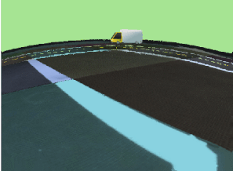

<!-- do not modify - autogenerated -->
 
# AI Driving Olympics

## Description
This is a solution baseline for [the AI Driving Olympics](http://aido.duckietown.org/) competition using Reinforcement
Learning & Imitation Learning via Supervised Learning (a.k.a. Behavioral Cloning) in **PyTorch**, **Tensorflow**, and
Tensorflow's **Keras** for the challenge [`aido_LF`](http://docs.duckietown.org/daffy/AIDO/out/lf.html). 

The [online description of this challenge is here][online]. 

For submitting, please follow [the instructions available in the book][book].

[book]: http://docs.duckietown.org/daffy/AIDO/out/
[online]: https://challenges.duckietown.org/

Most of the code is explained within its script as well as in the corresponding folder's README.

## Getting Started
Go ahead and 

You can train a reinforcement learning agent (expert) that learns to drive perfectly within an environment. Then you can
run the agent on a bunch of different maps/environments to collect data (observation & action pairs) to imitate the expert's
behaviour, a.k.a. Imitation Learning, Behaviour Cloning. Finally, you have an agent that navigates within an environment
using only one single sensor, the camera.

## Installation/Requirements
Follow the installation steps explained in [this GitHub repository](https://github.com/duckietown/gym-duckietown#installation),
which is the official repository of the simulator used at the competition.

**Note:** You do not need to install anything on your local PC to use the notebook on Colab! That means, without any installation
you can train both networks: The RL agent and the IL agent, which at the end yields a self-driving agent! Therefore, you would
only need to install the required packages to your local PC if you want to evaluate, visualize how the trained agents work.

## More info on the repository
#### Who can use this repository?
This repository can be used by anyone who would like to ground his/her knowledge in `Reinforcement Learning`,
`Imitation Learning`, `PyTorch`, `Tensorflow`, `Keras`, and `Self-Driving Cars`.

#### What you will learn & and get yourself familiarized with:
- Simulations in general and how to use them
- Image processing methods, use-cases  for Self-Driving Cars
- Reinforcement Learning and one method of RL, namely `DDPG` and its implementation in `PyTorch`
- Applying `DDPG` to: 
    - the "Hello World" of RL, namely [CartPole Problem](https://gym.openai.com/envs/CartPole-v0/) a.k.a. Inverted Pendulum
    
    
    
    - a Self-Driving Car that learns itself how to drive well in different environments
    
    

- How Imitation Learning can be applied to Self-Driving Cars by training neural network models with both `Tensorflow` and `Keras`
- Submission to a world-wide competition using `Docker` 

## Contact Details
This is a project within the curriculum of MSc. Intelligent Systems and supervised by [Dr.Andrew Melnik](https://ni.www.techfak.uni-bielefeld.de/people/anmelnik)
at University Bielefeld. If you are a student at University Bielefeld and interested in this project, Dr.Melnik would be happy to work with you! 